# Multi-Agent Coordination Patterns
## for Data-Driven Construction Automation

  
Based on: Anthropic Coordination Guidelines · DDC Skills Framework · Boiko (2025)

  
Construction AI Agent Swarm — Phase 5 Target Architecture

---
layout: default
---

# Agenda

  

    
01

    

      
The Construction Data Problem

      
Why construction lags behind other industries

    

  

  

    
02

    

      
Five Coordination Patterns

      
Definitions, selection criteria, trade-offs

    

  

  

    
03

    

      
Construction Applications

      
Cost estimation, schedules, BIM, documents

    

  

  

    
04

    

      
DDC Agent Swarm Architecture

      
Recommended production system design

    

  

---
layout: two-cols
---

# Construction's Data Problem

- **Last of 19 industries** in IT spending
- Banks decide in **minutes** — data only
- Agriculture decides in **hours** — data + experience
- Construction decides in **days** — opinion
- BIM and PMIS offer **highest ROI** potential
- Adoption remains **critically low**

  
"The digital future of construction is not just about new technologies — it is fundamentally rethinking data handling and business models."

  
— Boiko, DDC Book (2025)

::right::

  

    
Banking

    
Decisions in minutes — 100% data-driven

  

  

    
Agriculture

    
Decisions in hours — data + experience

  

  

    
Construction

    
Decisions in days — opinion-based

  

---
layout: default
---

# The DDC Framework: BIM + AI + Multi-Agent

  

    
BIM = Database

    
IFC files expose structured volumes, areas, materials via ifcopenshell — no 3D viewer required

  

  

    
55,719 CWICR Items

    
Standardized work item database in 9 languages — semantic search via Qdrant vector DB

  

  

    
Phase 5 Goal

    
Construction AI Agent Swarm: PLANNER · ESTIMATOR · SCHEDULER · VALIDATOR · REPORTER

  

  <strong style="color: #354A5F;">Gartner 2025:</strong>
   Multi-agent system inquiries surged 1,445% from Q1 2024 to Q2 2025. 40% of enterprise applications will embed AI agents by end of 2026.

---
layout: center
class: text-center
---

Five Coordination Patterns

Selecting the right architecture for each construction task

---
layout: default
---

# The Five Patterns at a Glance

| Pattern | Primary Strength | Construction Application |
|---------|-----------------|--------------------------|
| **Generator-Verifier** | Quality-critical output, explicit criteria | Cost estimate validation, BIM IDS compliance |
| **Orchestrator-Subagent** | Clear decomposition, parallel subtasks | IFC → cost estimate pipeline |
| **Agent Teams** | Long-running specialist context | Multi-package estimating, multi-building |
| **Message Bus** | Event-driven, extensible ecosystem | RFI processing, document routing |
| **Shared-State** | Collaborative knowledge accumulation | Project knowledge base, benchmarks |

  <strong style="color: #0070F2;">Production recommendation:</strong>
   Combine Orchestrator-Subagent + Shared-State + Generator-Verifier — not a single pattern

---
layout: two-cols
---

# Pattern 1: Generator-Verifier

**Best for:** Quality-critical outputs with explicit criteria

- Generator agent produces initial output
- Verifier checks against defined criteria
- Failure returns structured feedback to generator
- Loop continues until criteria are satisfied

  
Construction use cases

  
Cost estimate validation · BIM IDS compliance · Schedule logic checks

  
Key risk: early victory problem

  
Vague criteria produce rubber-stamp approval — be explicit

::right::

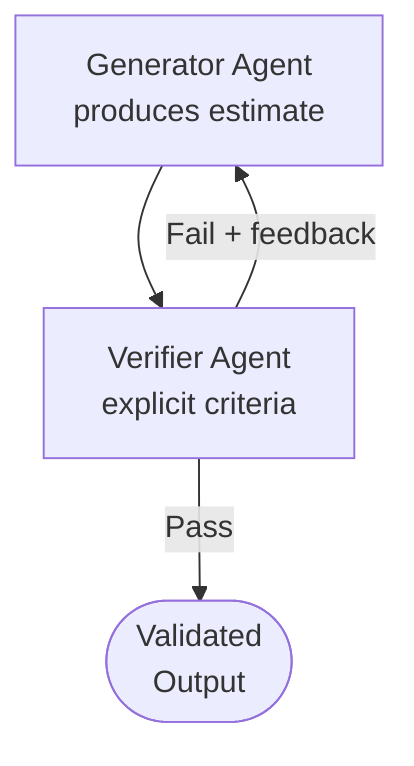

---
layout: two-cols
---

# Pattern 2: Orchestrator-Subagent

**Best for:** Multi-step tasks with clear decomposition

- Orchestrator decomposes and delegates tasks
- Subagents work in isolated context windows
- Each returns distilled, compact findings
- Orchestrator synthesizes final output

  
Construction use cases

  
IFC → cost estimation · BIM analysis · Complex document processing

  
Key benefit: context protection

  
5,000+ token IFC data never enters the Rate Calculator context

::right::

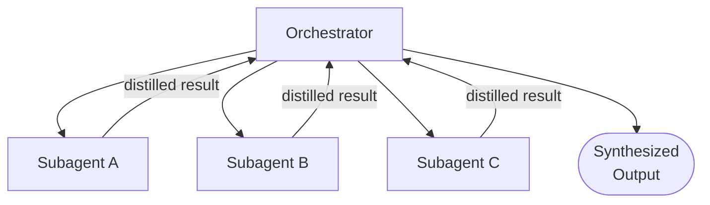

---
layout: two-cols
---

# Pattern 3: Agent Teams

**Best for:** Parallel long-running specialist analyses

- Coordinator assigns work from a shared queue
- Worker agents persist across many assignments
- Workers accumulate deep domain context
- Best for independent, partitioned workloads

  
Construction use cases

  
Multi-package estimating · Multi-building scheduling · Trade-specific analysis

  
Key requirement: independence

  
Teammates cannot share context directly — partition by trade or zone

::right::

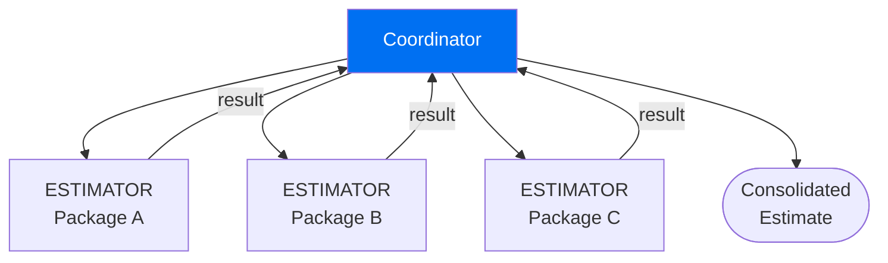

---
layout: two-cols
---

# Pattern 4: Message Bus

**Best for:** Event-driven, growing agent ecosystems

- Agents publish to topics and subscribe to events
- Router delivers matching messages automatically
- New agents added without rewiring existing ones
- Every event logged with timestamp and agent ID

  
Construction use cases

  
RFI processing · Change order tracking · Document routing · Submittal review

  
Key benefit: extensibility

  
New document types → new subscriber agents, no rewiring

::right::

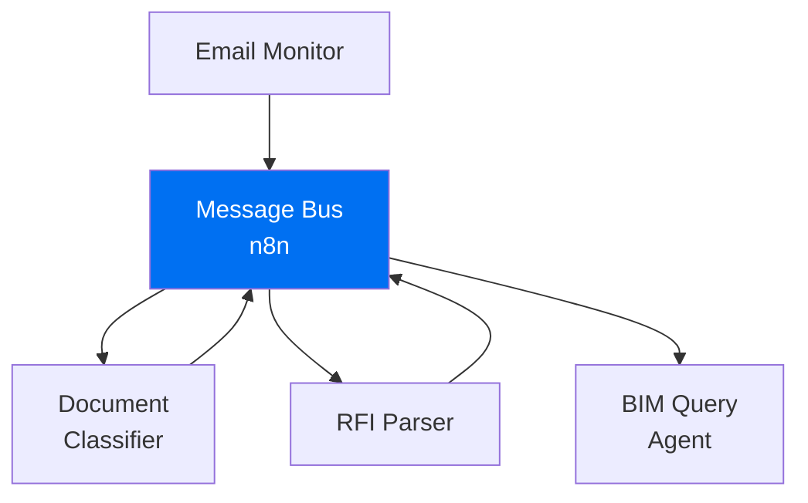

---
layout: two-cols
---

# Pattern 5: Shared-State

**Best for:** Collaborative knowledge accumulation

- No central coordinator — agents act autonomously
- All agents read and write to persistent store
- Write domains partitioned to prevent conflicts
- Termination: convergence signal from Validator

  
Construction use cases

  
Project knowledge base · Historical cost database · Cross-session institutional memory

  
Key risk: reactive loops

  
Each agent must write only to its designated domain

::right::

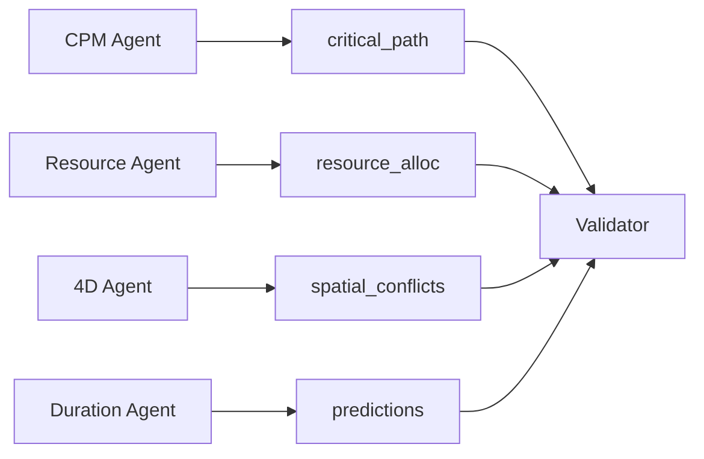

---
layout: two-cols
---

# Pattern Selection Guide

**Choose based on task characteristics:**

- Explicit quality criteria → **Generator-Verifier**
- Event-driven, growing ecosystem → **Message Bus**
- Long-running parallel specialists → **Agent Teams**
- Knowledge accumulation across agents → **Shared-State**
- Multi-step decomposition → **Orchestrator-Subagent**

  
Production systems combine patterns

  
Primary: Orchestrator-Subagent + Shared-State knowledge layer + Generator-Verifier quality gate

::right::

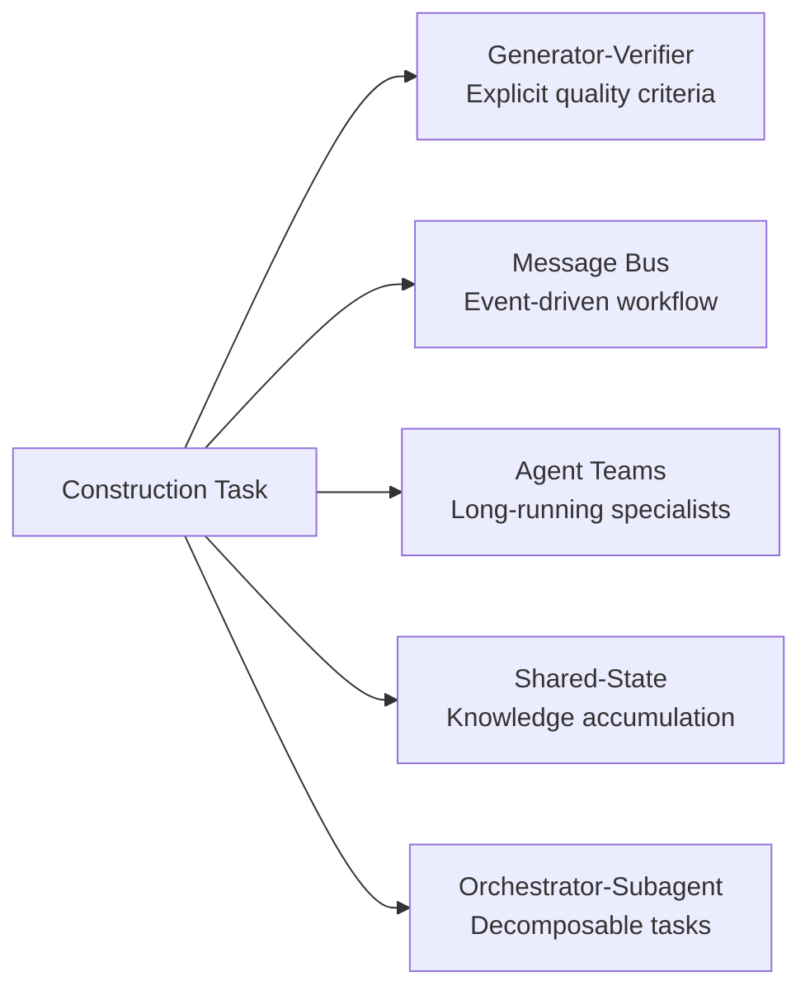

---
layout: center
class: text-center
---

Construction Applications

Deep dives: Cost Estimation · Scheduling · Documents · BIM

---
layout: default
---

# Recommended Hybrid Architecture

  

    
Orchestrator-Subagent

    
Primary workflow: decomposes tasks, dispatches specialized subagents, synthesizes outputs

    
IFC Parser · CWICR Matcher · Rate Calculator · Document Processor

  

  

    
Shared-State

    
Persistent knowledge layer: Qdrant + PostgreSQL accumulate institutional project knowledge across sessions

    
CWICR embeddings · Historical estimates · Document extracts

  

  

    
Generator-Verifier

    
Quality gate at every output: explicit criteria prevent false positives from reaching users

    
Estimate validation · Schedule verification · BIM compliance

  

  Anthropic:
   "A common hybrid uses orchestrator-subagent for the overall workflow with shared state for a collaboration-heavy subtask."

---
layout: two-cols
---

# Cost Estimation Pipeline
## 16 hours → 2 hours (87% faster)

- **Stage 1:** IFC Parser extracts element inventory
- **Stage 2:** CWICR Matcher — Qdrant semantic search
- **Stage 3:** Rate Calculator — PostgreSQL unit rates
- **Stage 4:** Validator — statistical range checks
- **Stage 5:** Orchestrator synthesizes final report

  
Context isolation benefit

  
5,000+ token IFC element data never enters the Rate Calculator context — clean subagent boundaries

::right::

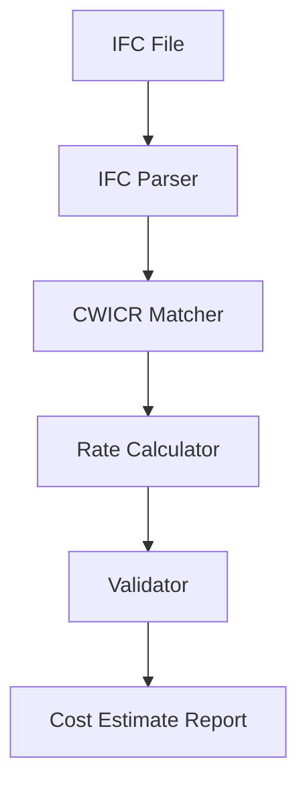

---
layout: two-cols
---

# Schedule Optimization
## Agent Teams + Shared-State

- **CPM Agent** writes critical path activities
- **Resource Agent** reads CPM, writes leveled durations
- **4D Simulation** reads both, writes spatial conflicts
- **Duration Agent** writes ML-predicted durations
- **Validator** monitors all sections — signals convergence

  
Write domain partitioning

  
Each agent writes only to its section — prevents reactive loops. polars: 7-10x faster than pandas for large activity networks.

::right::

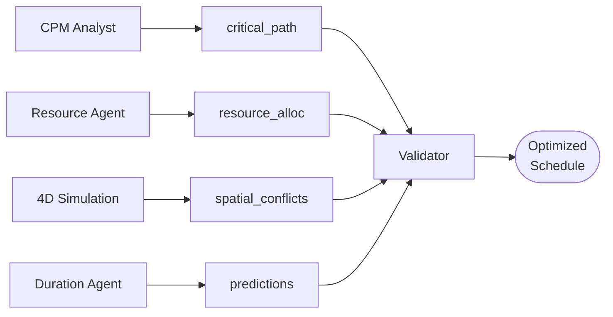

---
layout: two-cols
---

# RFI Document Processing
## Message Bus Pipeline

- **Email Monitor** publishes `documents.incoming`
- **Classifier** routes to `documents.rfi`
- **RFI Parser** extracts question and drawing refs
- **BIM Query** looks up elements via MCP4IFC
- **Response Drafter** generates draft answer
- **Approval Router** routes to engineer queue

  
Extensibility

  
Add submittal or change order agents by subscribing to new topics — no rewiring of existing agents

::right::

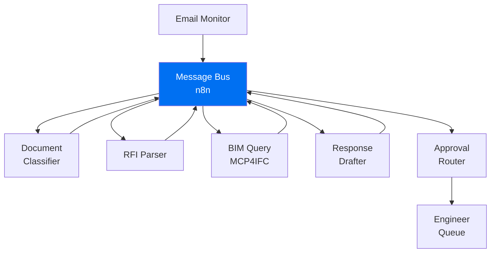

---
layout: two-cols
---

# BIM Analysis Orchestration
## Five-Subagent Pipeline

- **Subagent 1:** IFC Parser — spatial boundary filter
- **Subagent 2:** Element Classifier — OmniClass/UniClass
- **Subagent 3:** CWICR Matcher — top-5 similarity search
- **Subagent 4:** Rate Calculator — regional PostgreSQL rates
- **Subagent 5:** Validator — range checks + completeness

  
Provenance chain

  
Every estimate line traced to its IFC element — impossible in manual estimating. Full audit trail for dispute resolution.

::right::

  

    

      
1. IFC Parser

      
ifcopenshell · spatial boundary filter

    

    
↓

    

      
2. Element Classifier

      
OmniClass · UniClass · trade grouping

    

    
↓

    

      
3. CWICR Matcher

      
multilingual embeddings · Qdrant top-5

    

    
↓

    

      
4. Rate Calculator

      
regional PostgreSQL unit rates

    

    
↓

    

      
5. Validator

      
range + completeness checks · fail loops back

    

    
↓

    

      
Estimate Report with Provenance Chain

    

  

---
layout: center
class: text-center
---

Technical Infrastructure

MCP Integration · Czech NLP · Open-Source Stack

---
layout: two-cols
---

# Czech Language Challenge
## Morphological Complexity

- **7 grammatical cases** — one concept, 5+ surface forms
- "betonová zeď" → genitive, dative, instrumental, plural forms
- Standard regex misses **4 of 5** occurrences
- Construction CWICR covers **9 languages**

  
Three-layer solution

  <ul class="text-sm mt-1" style="color: #354A5F; list-style: disc; padding-left: 1rem;">
    <li>MorphoDiTa lemmatization (Charles University UFAL)</li>
    <li>multilingual-e5-large sentence embeddings</li>
    <li>Qdrant vector search — confidence threshold 0.75</li>
  </ul>

::right::

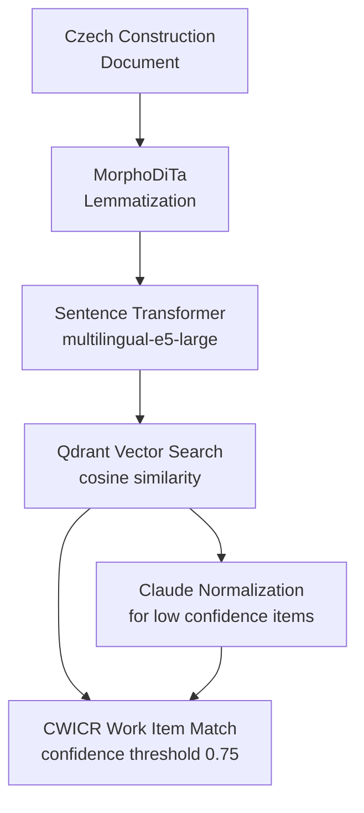

---
layout: default
---

# MCP Integration Architecture

  

    
Construction Agents

    

      
Orchestrator (Tool Search)

      
IFC Parser Subagent

      
CWICR Matcher Subagent

      
Rate Calculator Subagent

      
Document Processor Subagent

    

  

  

    
MCP Server Layer

    

      
Qdrant-MCP — search_work_items

      
PostgreSQL-MCP — rate tables

      
n8n-MCP — workflow triggers

      
Speckle-MCP — BIM data exchange

      
IFC Server MCP — 50+ BIM tools

    

  

  

    
External Data Systems

    

      
Qdrant DB (CWICR 55K items)

      
PostgreSQL (ERP + Rates)

      
n8n Workflows (400+ integrations)

      
Speckle Hub (BIM Models)

      
IFC OpenBIM Server

    

  

  <strong style="color: #0070F2;">Tool Search:</strong>
   Reduces tool-definition tokens by 85% — loads only tools relevant to the current request, preventing context flooding

---
layout: default
---

# Open-Source Technology Stack

| Category | Primary Tool | Why Choose It |
|----------|-------------|---------------|
| **BIM / IFC Processing** | ifcopenshell + MCP4IFC | 50+ LLM-native BIM tools, no license needed |
| **Vector Search** | Qdrant | 100M+ vectors, rich payload filtering, Rust speed |
| **Document Processing** | Docling (IBM) + pdfplumber | Complex PDF layouts, table extraction |
| **Data Processing** | polars (7-10x faster than pandas) | Columnar, multi-threaded, lazy evaluation |
| **Workflow Automation** | n8n | 400+ integrations, native AI agent nodes |
| **BIM Collaboration** | Speckle | Open-source, no Revit license, ACC integration |
| **ML Predictions** | scikit-learn + Prophet | Duration and KPI time-series forecasting |
| **Czech NLP** | MorphoDiTa + multilingual-e5-large | 500 noun paradigms, state-of-the-art accuracy |

---
layout: default
---

# DDC Construction Agent Swarm

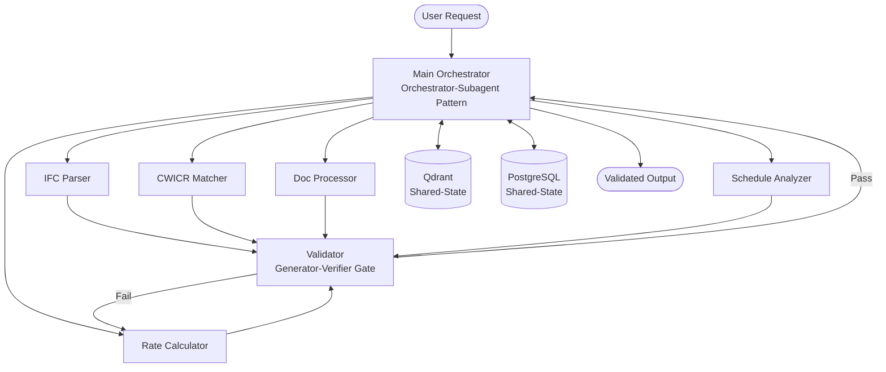

---
layout: center
class: text-center
---

Conclusion

---
layout: default
---

# Key Takeaways

  

    
Five Patterns, Five Problems

    
Each pattern solves a distinct construction challenge — choose based on task characteristics, not convention

  

  

    
87% Time Saving Verified

    
Cost estimation: 16 hours → 2 hours via IFC → CWICR Qdrant → PostgreSQL rates pipeline

  

  

    
Hybrid is the Target State

    
Orchestrator-Subagent + Shared-State + Generator-Verifier is the recommended production architecture

  

  

    
MCP + Skills = Production

    
Skills provide procedural knowledge; MCP servers provide tool access — together they reach production construction systems

  

  The agentic future of construction is already under construction in the DDC Skills repository

---
layout: center
class: text-center
---

# Thank You

  
Data-Driven Construction (DDC)

  

    
<strong>DDC Book (2025)</strong> — Artem Boiko

    
<strong>DDC Skills Repository</strong> — github.com/datadrivenconstruction

    
<strong>MCP4IFC Framework</strong> — Open-source BIM tools for LLMs

    
<strong>Anthropic</strong> — Multi-Agent Patterns Documentation

  

  

    
Complete Open-Source Stack

    
ifcopenshell · Qdrant · Docling · polars · n8n · Speckle · MorphoDiTa · scikit-learn

  

