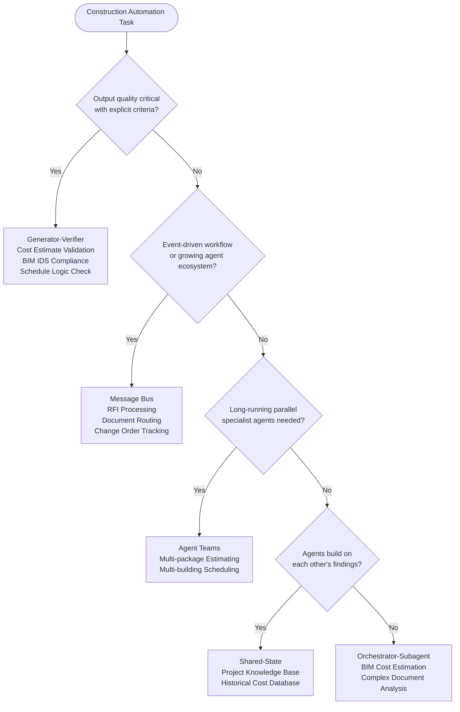
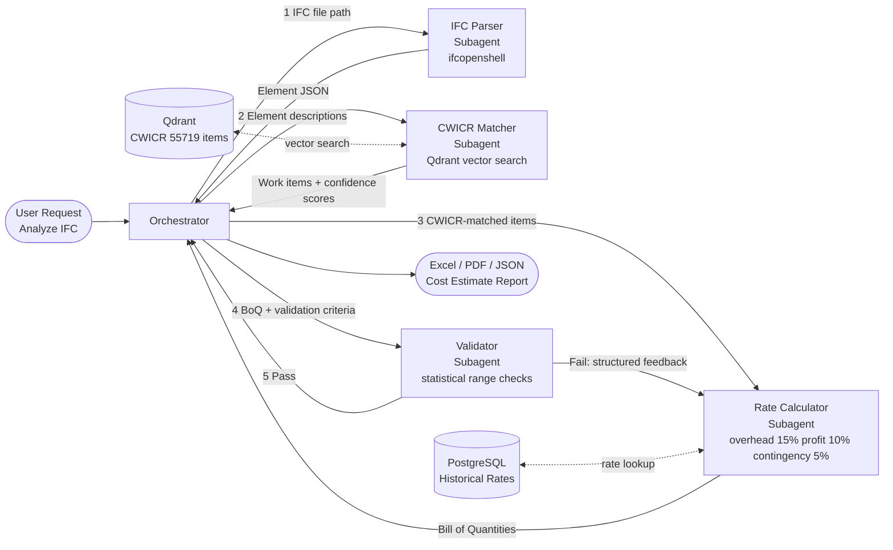
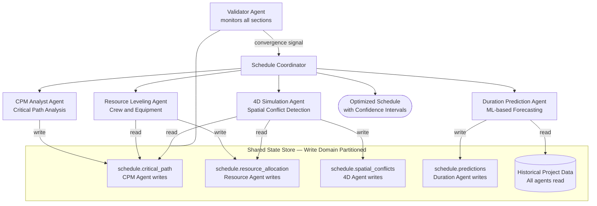
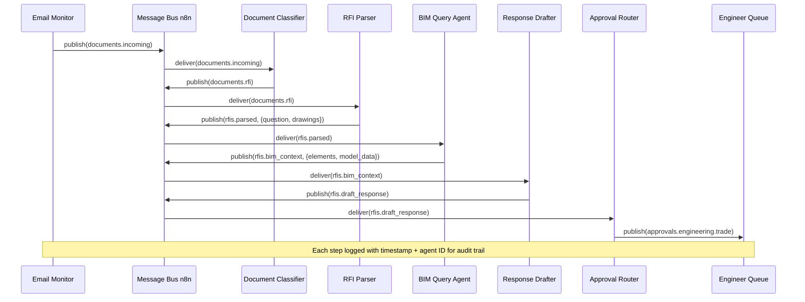
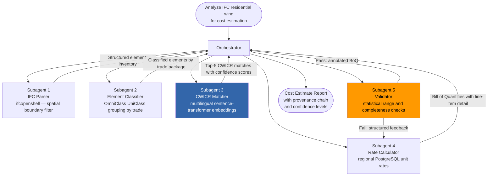
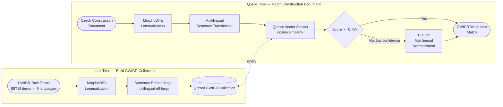
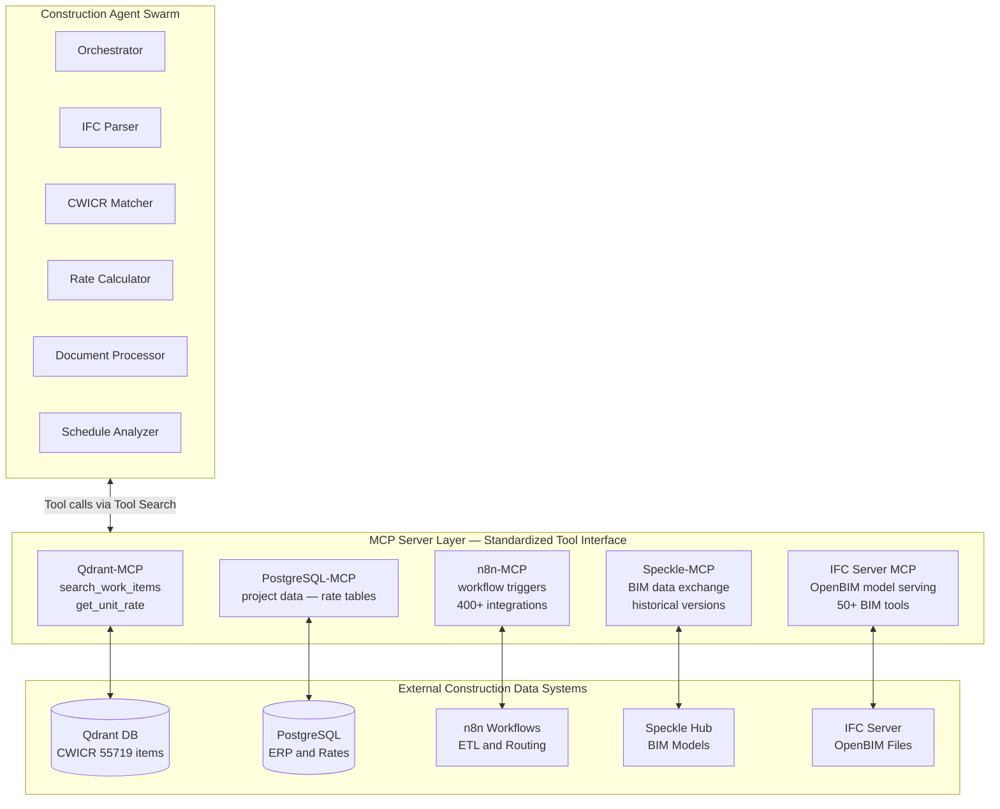
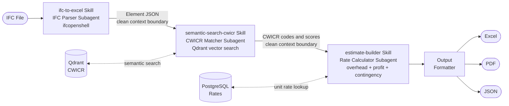
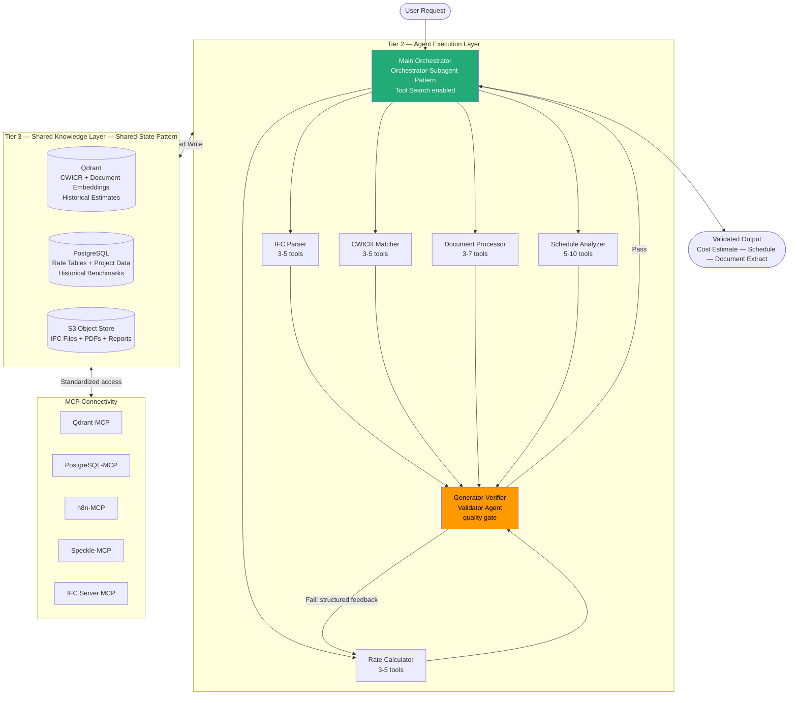

# Multi-Agent Coordination Patterns for Data-Driven Construction Automation: A Comprehensive Technical Analysis

This report provides an exhaustive analysis of how five multi-agent coordination patterns — Generator-Verifier, Orchestrator-Subagent, Agent Teams, Message Bus, and Shared-State — map to specific construction automation tasks within an agentic Claude Code implementation using the Data-Driven Construction (DDC) Skills framework. Drawing on Anthropic's published coordination pattern guidelines, Artem Boiko's second-edition DDC book (2025), the DDC Skills repository, and an extensive body of 2025–2026 research into construction AI systems, the report demonstrates that the construction industry stands at a critical inflection point where multi-agent orchestration can eliminate data silos, reduce estimation time from sixteen hours to two, and systematically transform opinion-based decision-making into data-driven automation. The recommended primary architecture is Orchestrator-Subagent augmented by Shared-State as a persistent knowledge layer and Generator-Verifier loops at critical quality checkpoints, with MCP servers providing standardized connectivity to BIM tools, vector databases, ERP systems, and document stores.

## The Construction Industry's Data Imperative and the Multi-Agent Opportunity

### From Opinion to Data: The Structural Problem

The construction industry has historically operated as one of the last major economic sectors to make decisions based on human opinion rather than systematically processed data. As Boiko (2025) documents in the DDC Book's Introduction, while the banking industry makes decisions in minutes based on data, and the agricultural industry makes decisions in hours based on a combination of data and opinion, the construction industry characteristically makes decisions in days, overwhelmingly based on opinion.[1] This is not a minor inefficiency — it represents a structural vulnerability that machine learning, agentic AI, and multi-agent orchestration can directly address.

The KPMG survey of construction managers (2023) cited in the DDC Book indicates that project management information systems (PMIS), advanced data analytics, and Building Information Modeling (BIM) have the greatest potential to deliver return on investment on capital projects.[1] Yet the same industry that acknowledges this potential ranks last among nineteen industries in IT spending, according to the IT Metrics Key Data 2017 report.[1] The gap between acknowledged potential and realized capability is precisely where DDC Skills and Claude Code multi-agent systems can intervene.

The DDC Book's core concept — that BIM, ERP, Excel, and PDF files are all databases in different formats — provides the conceptual foundation for multi-agent design.[1] Behind every Revit file is a structured database. Behind every PDF contract is unstructured text. Behind every IFC model is a queryable ontology of building elements with volumes, areas, materials, and relationships. Understanding data types and their automation implications is the prerequisite for choosing the correct coordination pattern, as each pattern maps to a different combination of data types and task characteristics.

### The DDC Skills Architecture

The DDC Skills collection, as structured in the repository, organizes capabilities into five hierarchical categories: DDC Toolkit (CAD converters, CWICR semantic search), DDC Book (chapter-linked educational skills), DDC Insights (automation workflows including n8n pipelines), DDC Curated (community-curated document and verification skills), and DDC Innovative (advanced AI/ML capabilities including cost prediction and vector search).[1] The IMPROVEMENT_ROADMAP.md defines a five-phase construction automation maturity model, with Phase 5 — Multi-Agent Orchestration — targeting a Construction AI Agent Swarm consisting of a PLANNER Agent, ESTIMATOR Agent, SCHEDULER Agent, ORCHESTRATOR, DOCUMENT Agent, VALIDATOR Agent, and REPORTER Agent.[1]

Gartner predicts that 40% of enterprise applications will embed AI agents by the end of 2026, with multi-agent system inquiries surging 1,445% from Q1 2024 to Q2 2025.[2] The construction industry is moving from pilots in 2026 toward full BIM and IFC automation, prioritizing governance for secure data handling in regulated environments.[2] The five coordination patterns described by Anthropic provide the engineering vocabulary for designing these systems correctly.

## The Five Coordination Patterns: Definitions and Construction Relevance

### Pattern 1: Generator-Verifier

The Generator-Verifier pattern is the simplest multi-agent design and among the most widely deployed. A generator agent receives a task and produces an initial output, which it passes to a verifier agent for evaluation.[3] The verifier checks whether the output meets explicit criteria and either accepts it as complete or rejects it with targeted feedback. If rejected, that feedback routes back to the generator for a revised attempt. This loop continues until the verifier accepts the output or a maximum iteration count is reached.[3]

In the construction context, this pattern is exceptionally well-suited to cost estimate validation, BIM model compliance checking against IDS (Information Delivery Specification) schemas, and schedule logic verification. A cost estimating generator agent that queries the CWICR database (55,719 standardized work items in 9 languages) and applies markup calculations produces an estimate that a verifier agent can cross-check against historical unit rate ranges, flag line items with quantities exceeding statistical norms, and confirm that all IFC-extracted quantities match the estimate's scope.[1] The verifier requires no knowledge of how the estimate was produced — it only needs explicit criteria, such as "unit costs for reinforced concrete must fall between €120 and €280 per cubic meter" or "total estimate variance from benchmarks must not exceed 15%."

The critical failure mode for this pattern, as Anthropic documents, is the "early victory problem" — a verifier told only to check whether output is "good" will rubber-stamp the generator's output without substance.[3] For construction estimates, this means verification criteria must be explicit: run the full cross-check against the historical database, validate all quantities against IFC export data, confirm markup percentages are within approved ranges, and flag any line items with no matching CWICR code. Without this specificity, the pattern creates the illusion of quality assurance without the substance.

### Pattern 2: Orchestrator-Subagent

Orchestrator-Subagent is the most broadly applicable pattern, suitable for the widest range of construction automation problems. A lead agent receives a task, plans the approach, delegates specific subtasks to specialized subagents, and synthesizes the returned results.[3] Claude Code itself uses this pattern: the main agent writes code, edits files, and runs commands, dispatching subagents in the background when it needs to search a large codebase or investigate independent questions in parallel.[3]

The pattern excels when task decomposition is clear and subtasks have minimal interdependence. A complex BIM analysis request — "Analyze this IFC model for cost estimation" — decomposes cleanly into IFC parsing (extract quantities with ifcopenshell), CWICR matching (vector search to map elements to work items), rate calculation (apply unit costs and markups), and validation (cross-check quantities, flag anomalies). Each subagent operates in its own context window, returning distilled findings to the orchestrator. This keeps the orchestrator's context focused on synthesis while exploration happens in parallel.[3]

The primary limitation is that the orchestrator becomes an information bottleneck. When a subagent's discovery is relevant to another subagent's work, that information must travel back through the orchestrator. For construction workflows where the IFC parser discovers that wall elements have missing material property sets, the orchestrator must recognize this impacts the rate calculator's ability to look up material-specific unit costs and route the information accordingly. After several such handoffs, critical details may be lost or summarized away.[3]

### Pattern 3: Agent Teams

Agent Teams extend the Orchestrator-Subagent pattern by replacing short-lived, single-task subagents with persistent worker agents that accumulate context and domain specialization across multiple assignments.[3] A coordinator spawns independent worker agents as processes, assigns tasks from a shared queue, and collects outcomes while workers operate autonomously. The difference is worker persistence: an orchestrator-subagent subagent terminates after returning a result, while a teammate stays alive across many assignments.

In construction terms, the Agent Teams pattern is ideal for large multi-building projects where each building or construction package can be assigned to a persistent specialist agent. A team of ESTIMATOR Agents, each assigned a different building wing or trade package, develops sustained familiarity with its assigned scope — the material specifications, the local rate conditions, the subcontractor pricing — and applies that accumulated context to produce better estimates over time than fresh-context subagents could. The Coordinator assembles final estimates and runs cross-package consistency checks.

Independence is the critical requirement. If one teammate's work affects another's — for example, if the structural steel package quantities affect the mechanical package routing — neither teammate is aware, and their outputs may conflict.[3] This constraint means Agent Teams work best for construction tasks that can be partitioned by trade, building zone, or project phase, where inter-partition dependencies are minimal.

### Pattern 4: Message Bus

The Message Bus pattern introduces a shared communication layer where agents publish and subscribe to events rather than receiving direct instructions from a coordinator.[3] Agents subscribe to topics they care about; a router delivers matching messages. New agents can start receiving relevant work without rewiring existing connections.

For construction, the Message Bus is most relevant to continuous monitoring and event-driven automation workflows. Consider a construction project management system where an RFI (Request for Information) arrives via email, is classified by a triage agent, routed to a document analysis agent that extracts the technical question, forwarded to a BIM query agent that looks up the relevant model element, passed to a response drafting agent, and finally sent for human approval review. As new document types emerge — submittals, change orders, progress claims — new agents can subscribe to the relevant event topics without modifying existing connections.[3]

The flexibility of event-driven communication makes tracing harder. When an incoming document triggers a cascade of events across five agents, understanding what happened requires careful logging and correlation.[3] For construction workflows where audit trails are legally significant — contract documents, change orders, RFI responses — this is not a minor concern. The Message Bus pattern requires robust logging infrastructure before deployment in regulated construction contexts.

### Pattern 5: Shared-State

The Shared-State pattern removes the central coordinator entirely, allowing agents to coordinate through a persistent store that all can read and write directly.[3] Agents operate autonomously, reading from and writing to a shared database, file system, or document. Work begins when an initialization step seeds the store with a question or dataset, and ends when a termination condition is met.

In construction, the Shared-State pattern provides the foundation for a continuously evolving project knowledge base. As the PLANNER Agent defines scope, the ESTIMATOR Agent reads that scope and writes cost information, the SCHEDULER Agent reads cost assumptions and writes time-phased resource demands, and the DOCUMENT Agent reads the current project state and writes extracted information from incoming contracts and specifications. Each agent's findings immediately become available to all other agents without waiting for a coordinator to route information.[3] The shared store — a Qdrant vector database combined with a PostgreSQL relational store — becomes an evolving knowledge base that grows richer as the project proceeds.

The failure mode to avoid is reactive loops: Agent A writes a finding, Agent B reads it and writes a follow-up, Agent A sees the follow-up and responds.[3] For construction knowledge bases, this means each agent must have explicit write domains (the ESTIMATOR writes to cost tables, the SCHEDULER writes to timeline records) and explicit termination conditions (the analysis completes when no new elements have been added to the shared store for N minutes, or when the VALIDATOR Agent issues a convergence signal).[3]

## Mapping Patterns to Construction Tasks

### The Master Mapping Table

The following table summarizes the recommended pattern assignments for the four key construction automation task categories, drawing on the structural characteristics of each task and the pattern selection heuristics established by Anthropic.[3]

| Pattern | Primary Strength | Construction Task | DDC Skills Used | Selection Rationale |
|---|---|---|---|---|
| Generator-Verifier | Quality-critical output, explicit criteria | Cost Estimate Validation, BIM IDS Compliance, Schedule Logic Check | verification-loop, estimate-validation, bim-validation-pipeline | Output quality is paramount; evaluation criteria are explicit and automatable |
| Orchestrator-Subagent | Clear decomposition, parallel subtasks | BIM Cost Estimation (IFC→Estimate), Complex Document Analysis | ifc-to-excel, semantic-search-cwicr, pdf-construction, estimate-builder | Task decomposes cleanly into IFC parsing, matching, calculation, validation |
| Agent Teams | Parallel, long-running, domain-specialist subtasks | Multi-package Estimating, Multi-building Scheduling, Large Codebase Migration | cost-prediction, duration-prediction, schedule-validation | Each package/building benefits from sustained specialist context |
| Message Bus | Event-driven, growing agent ecosystem | RFI Processing Pipeline, Document Routing, Change Order Tracking | n8n-document-router, webhook-processor, n8n-approval-workflow | Workflow emerges from events; new document types require new agent subscriptions |
| Shared-State | Collaborative accumulation, agents build on each other | Project Knowledge Base, Historical Cost Database, Multi-phase Research | kpi-dashboard, data-quality-check, vector-search-cwicr, ontology-mapper | Findings from one agent immediately inform all other agents; no central bottleneck |

The following decision tree guides pattern selection for any construction automation task:

### Recommended Hybrid: Orchestrator + Shared-State + Generator-Verifier

Production construction systems will typically combine patterns rather than use a single approach. Anthropic explicitly recommends that production systems combine patterns: "A common hybrid uses orchestrator-subagent for the overall workflow with shared state for a collaboration-heavy subtask."[3] For the DDC Skills Construction AI Agent Swarm, the optimal hybrid is:

The **Orchestrator-Subagent** pattern governs the primary workflow — receiving user requests, decomposing tasks, dispatching specialized subagents (IFC Parser, CWICR Matcher, Rate Calculator, Document Processor), and synthesizing final outputs. The **Shared-State** pattern provides the persistent knowledge layer — a vector database (Qdrant) storing historical estimates, project benchmarks, CWICR embeddings, and document extracts that all agents can read and write directly, accumulating institutional knowledge across sessions. The **Generator-Verifier** pattern enforces quality at critical checkpoints — after cost estimate generation, after schedule production, after BIM model analysis — ensuring outputs meet explicit criteria before delivery to end users.

## Deep Dive: Cost Estimation with Orchestrator-Subagent

### The CWICR Foundation

The CWICR (Classification of Work Items for Cost Reports) database is the semantic core of the DDC cost estimation system, containing 55,719 standardized work items in 9 languages.[1] Without a semantic search capability, matching free-text descriptions from IFC models or PDF specifications to the correct CWICR work item requires manual lookup — the primary bottleneck in traditional estimating. The Getting Started guide demonstrates that with Qdrant vector search, any query finds the correct item: "concrete foundation pour," "cast-in-place foundation," and "foundation concrete work" all resolve to work item 03.30.00 "Concrete works - foundations."[1]

The vector search capability depends on embedding the CWICR database into a high-dimensional semantic space. Qdrant, the recommended vector database, is Rust-based for fast writes and queries, supports rich payload filtering (numeric, geo, datetime), and handles over 100 million vectors with distributed sharding and replication.[4] For the CWICR collection of 55,719 items, Qdrant deployed on-premise adds essentially no cost beyond infrastructure, making it appropriate for construction firms handling sensitive project data that cannot leave internal systems.[4]

### The Orchestrator-Subagent Cost Estimation Workflow

A complete cost estimation request processed by the Orchestrator-Subagent pattern proceeds through the following stages, each handled by a specialized subagent operating in an isolated context window:

**Stage 1 — IFC Parsing Subagent.** The orchestrator receives the IFC file path and dispatches an IFC Parser Subagent with a focused mandate: extract all building elements with their quantities, material properties, and spatial relationships. The subagent uses ifcopenshell, the open-source Python library that is the industry-standard toolkit for IFC parsing and geometry processing.[5] For standard-sized models (under 2 GB), the subagent uses `ifcopenshell.open()` to load the full file; for larger models it uses streaming mode (`should_stream=True`) to reduce memory consumption to approximately 0.35–0.5 times the baseline, at the cost of 2.6–3.2 times slower access.[5] The subagent extracts IfcWall, IfcSlab, IfcBeam, IfcColumn, IfcDoor, IfcWindow, and IfcBuildingElementProxy instances, reading `Qto_WallBaseQuantities`, `Qto_SlabBaseQuantities`, and `Pset_WallCommon` property sets to obtain net volumes, net areas, and material specifications. It returns a structured JSON summary of extracted quantities — not the full IFC data — to the orchestrator.

**Stage 2 — CWICR Matcher Subagent.** The orchestrator passes the extracted element list to a CWICR Matcher Subagent, which performs semantic vector search against the Qdrant CWICR collection for each element type. This subagent encodes each element description (including material, function, and geometric characteristics) into a semantic vector using a multilingual embedding model, queries the closest CWICR work items by cosine similarity, and returns the top matches with confidence scores. Elements with confidence below 0.75 are flagged for manual review. The use of semantic embeddings rather than keyword matching is essential: as the DDC Book explains, IFC property names and material specifications appear in highly varied forms across different modeling firms, and only semantic similarity can bridge these terminological variations.[1]

**Stage 3 — Rate Calculator Subagent.** The orchestrator passes the CWICR-matched work items to a Rate Calculator Subagent, which queries the historical rate database (stored in PostgreSQL) for applicable unit costs by region, time period, and project type. It applies the configurable markup structure — overhead (15%), profit (10%), contingency (5%) by default as shown in the DDC Book's `EstimateBuilder` class — and computes line item totals.[1] The subagent returns a structured estimate with line-item breakdowns, subtotals by work category, and a total with markups.

**Stage 4 — Validator Subagent.** The orchestrator dispatches a Validator Subagent with the completed estimate and explicit verification criteria. This subagent cross-checks quantities against building code area ratios (wall area per floor area should fall within typical ranges for the building type), verifies that each line item has a matching CWICR code, confirms that unit rates fall within acceptable statistical ranges from historical benchmarks, and flags any line item where the total exceeds 20% of the project budget (a potential data extraction error). The validator applies the Generator-Verifier pattern at this micro-level: if the estimate fails validation, it returns detailed feedback to the Rate Calculator for revision, not just a pass/fail result.

**Stage 5 — Synthesis.** The orchestrator receives validated results from all subagents, synthesizes the final cost estimate report in the user's requested format (Excel, PDF, or structured JSON), and appends the validation summary showing which items were flagged, which were revised, and the final confidence level. The Getting Started guide documents that this workflow reduces estimate creation time from sixteen hours to two — an 87% time saving.[1]

The following pipeline diagram shows the five-stage data flow, including the Generator-Verifier feedback loop at Stage 4:

### Context Protection Through Subagent Isolation

A key technical benefit of this architecture is context protection. As Anthropic explains, when a single agent processes the full IFC file, applies CWICR matching, performs rate calculation, and runs validation, it accumulates thousands of tokens of element data that become irrelevant to subsequent reasoning steps.[3] The IFC Parser's full output may contain 5,000+ tokens of element records; once the CWICR Matcher has processed these into matched work items, the raw element data should not pollute the Rate Calculator's context. By isolating each operation in its own subagent with a clean context window, the orchestrator receives only compact, distilled findings from each stage, keeping the synthesis context focused and high-quality.[3]

## Deep Dive: Schedule Optimization with Agent Teams and Shared-State

### The CPM and 4D-8D Context

Construction scheduling is inherently multi-dimensional. The DDC Book's Part 5 covers the digitalization of cost and scheduling calculations, including automation of quantity extraction from BIM models, 4D-8D modeling technologies, and ESG calculations for construction projects.[1] A 4D model links BIM elements to schedule activities, enabling visual simulation of construction sequence. An 8D model extends this to cost, safety, and sustainability dimensions. Optimizing a construction schedule against these dimensions simultaneously exceeds the context capacity of a single agent.

The Agent Teams pattern is well-suited here because schedule optimization decomposes into independent analyses of different project constraints: Critical Path Method (CPM) analysis of activity dependencies, resource leveling to prevent over-allocation of crews and equipment, 4D BIM simulation to identify spatial conflicts in construction sequence, and duration prediction using historical ML models. Each of these analyses requires sustained, multi-step work that benefits from accumulated context.[3] A CPM Analyst Agent that has worked extensively with the activity network for a specific project phase develops a better understanding of the network's sensitive paths than a fresh-context subagent could.

### The Shared-State Knowledge Accumulation Layer

The Shared-State pattern provides the integration mechanism for schedule optimization. As the CPM Analyst Agent identifies critical path activities, it writes findings to the shared store. The Resource Leveling Agent reads the critical path information and writes resource-leveled durations. The 4D Simulation Agent reads both and writes spatial conflict identifications. The Duration Prediction Agent reads historical analogous project data from the shared store and writes predicted durations with confidence intervals.[3]

The critical engineering requirement is clear write domain partitioning. Each agent writes only to its designated section of the shared store, preventing the reactive loop failure mode.[3] The CPM Agent writes to `schedule.critical_path`, the Resource Agent writes to `schedule.resource_allocation`, the 4D Agent writes to `schedule.spatial_conflicts`, and the Duration Agent writes to `schedule.predictions`. The VALIDATOR Agent monitors all four sections and signals convergence when all agents' latest writes are consistent with each other and no new findings have appeared for five minutes.

The following diagram shows the agent team coordination and write-domain partitioning in the shared store:

The pandas and polars libraries are the recommended data processing tools for the shared store's time-series data.[6] Polars, written in Rust, operates 7–10 times faster than pandas on groupby, filtering, and join operations relevant to schedule analysis, making it the preferred choice for processing large activity networks and resource histograms.[6] scikit-learn's time-series forecasting capabilities, using lagged features to predict activity durations from historical project analogues, provide the ML backbone for the Duration Prediction Agent.[6]

## Deep Dive: Document Processing with Message Bus

### The Unstructured Document Challenge

Construction projects generate vast volumes of unstructured documents: PDF contracts, RFIs, submittals, specifications, change orders, site reports, and scanned drawings. The DDC Book's data classification framework identifies unstructured data as requiring AI or OCR for processing, with no inherent schema.[1] The Getting Started guide notes that contracts in SharePoint — "2000 documents" in the illustrative example — are accessed only through manual search, with no automatic integration to other systems.[1] Bridging this gap requires a document processing pipeline that can receive diverse incoming document types, route them appropriately, extract structured information, and insert findings into the project knowledge base.

The Message Bus pattern is the correct choice because the workflow emerges from events rather than a predetermined sequence, and the agent ecosystem is expected to grow as new document types are encountered.[3] An RFI and a submittal require different processing: an RFI requires question extraction, BIM element lookup, and draft response generation; a submittal requires specification comparison, compliance checking, and approval routing. As new document types emerge — variation orders, claim notices, final account statements — new subscriber agents can be added without modifying existing connections.

### Open-Source Document Processing Tools

The 2025 tool landscape for construction document processing offers several strong open-source options. **Docling**, IBM's open-source library, provides AI-powered conversion for diverse document formats including PDFs with complex layouts, tables, and multi-column text, with native integration into LangChain, LlamaIndex, and other GenAI frameworks.[7] It ranked among the top document parsing tools in 2025 for construction PDFs with embedded drawings and specification tables.[7] **pdfplumber** provides precise PDF text and table extraction in Python pipelines, particularly effective for structured PDFs with consistent layouts such as cost schedules and BOQs.[7] **Marker** offers high-accuracy PDF-to-Markdown conversion with OCR support for scanned documents, making it suitable for legacy construction documents that exist only in scanned form.[7] **Unstructured.io** processes PDFs, Excel files, and images, partitioning documents into typed elements (text blocks, tables, headers, footers) that can be fed directly to LLM processing stages.[7]

For the Message Bus construction document pipeline, the recommended architecture routes all incoming documents through Unstructured.io for initial element partitioning, then routes structured table elements to pandas/polars for tabular data extraction while routing text elements to Docling or Marker for semantic processing. The n8n workflow automation platform provides the event bus infrastructure, handling webhook triggers from email systems, document management portals, and BIM collaboration platforms, with 400+ integrations available and native support for AI agent nodes.[8] n8n workflows function as "tools" for LLMs — the orchestrator agent calls n8n workflow endpoints as external actions, while n8n handles the reliable ETL mechanics of polling, retry, validation, and batching.[8]

### The RFI Processing Pipeline

A concrete Message Bus implementation for RFI processing proceeds through the following event-driven stages: An incoming email containing an RFI is published to the `documents.incoming` topic by the Email Monitor Agent. The Document Classifier Agent, subscribed to `documents.incoming`, classifies the document as an RFI and publishes to `documents.rfi`. The RFI Parser Agent, subscribed to `documents.rfi`, extracts the technical question, the referenced drawing numbers, and any attached sketches, then publishes to `rfis.parsed`. The BIM Query Agent, subscribed to `rfis.parsed`, looks up the referenced elements in the IFC model using the MCP4IFC framework or the Autodesk AEC Data Model MCP server, then publishes to `rfis.bim_context`.[9] The Response Drafting Agent, subscribed to `rfis.bim_context`, generates a draft technical response and publishes to `rfis.draft_response`. The Approval Router Agent, subscribed to `rfis.draft_response`, routes to the appropriate engineer's queue based on trade classification, publishing to `approvals.engineering.[trade]`. At each stage, the event is logged with timestamp and agent identifier, creating a full audit trail compliant with construction contract requirements.

The following sequence diagram shows the event-driven message flow across the six agents:

## Deep Dive: BIM Data Analysis with Orchestrator-Subagent

### The IFC as a Database

The DDC Book provides a fundamental insight: "IFC ≠ Just a 3D Model; IFC = Structured Database."[1] The IFC file hierarchy — IfcProject → IfcSite → IfcBuilding → IfcBuildingStorey → IfcWall → Pset_WallCommon (properties) → BaseQuantities (quantities) — contains volumes, areas, materials, relationships, and specification data that can be extracted and processed programmatically.[1] This insight transforms BIM data analysis from a visualization task requiring expensive licensed software into a data extraction and processing task suitable for open-source agentic automation.

The MCP4IFC framework, an open-source MCP server published in 2025, provides over 50 BIM tools for LLMs to create, edit, and query IFC models using natural language instructions.[9] Built on ifcopenshell and Blender, it supports dynamic tool generation via in-context learning and retrieval-augmented generation, enabling Claude Code to build IFC queries programmatically without requiring users to know IFC schema syntax.[9] The Autodesk AEC Data Model MCP server connects Claude-compatible agents to Autodesk's data model for natural language interaction with ElementGroups, Elements, Projects, and Hubs.[9] Speckle, the open-source BIM data platform, launched an Autodesk Construction Cloud integration in December 2025 that automatically syncs ACC models to Speckle for real-time access, historical versions, and change tracking without requiring Revit or ACC licenses.[9]

### The Complete BIM Analysis Orchestration

A complete Orchestrator-Subagent BIM analysis for cost estimation proceeds as follows. The Orchestrator receives the user request: "Analyze this IFC model for cost estimation of the residential wing." It parses the request, determines the scope (residential wing only), identifies the required subagents (IFC Parser, Element Classifier, CWICR Matcher, Rate Calculator, Validator), and establishes the communication protocol for inter-agent data transfer.

**Subagent 1 — IFC Parser** uses ifcopenshell to open the model and extract all building elements within the residential wing's spatial boundary (defined by IfcBuildingStorey entities). It processes quantity sets (Qto_WallBaseQuantities for walls, Qto_SlabBaseQuantities for floors and roofs, Qto_BeamBaseQuantities for structural elements) and property sets (Pset_WallCommon.IsExternal, Pset_ConcreteElementGeneral.ReinforcementVolumeRatio) to produce a structured element inventory. For memory-intensive models, the subagent uses single-threaded iteration to minimize RAM consumption.[5]

**Subagent 2 — Element Classifier** takes the raw element inventory and enriches it with construction classification codes (OmniClass, UniClass, or project-specific codes), identifies elements with missing or incomplete data (flagged for the validator), and groups elements by trade package (concrete works, steel works, masonry, finishes, MEP). This classification step is essential for routing elements to the correct CWICR work item families during semantic search.

**Subagent 3 — CWICR Matcher** performs semantic vector search against the Qdrant CWICR collection for each classified element group. Using a multilingual sentence-transformer model (particularly important for projects using Czech, German, or Spanish specifications), it encodes element descriptions and queries for the top-5 nearest CWICR work items by cosine similarity. Items with similarity below 0.75 receive a "low confidence" flag and are included in the validation report for manual review.

**Subagent 4 — Rate Calculator** applies regional unit rates from the historical PostgreSQL database to each matched CWICR item, applies the project-specific markup structure, and computes quantities by unit (m³ for concrete, m² for formwork, ton for reinforcing steel, m² for finishes). It outputs a structured Bill of Quantities with line-item detail.

**Subagent 5 — Validator** cross-checks the Bill of Quantities against multiple criteria: statistical range checks on unit rates, quantity ratio checks (concrete volume to formwork area should fall within a known range for wall construction), completeness checks (all IfcBuildingElement types have at least one CWICR match), and consistency checks (no duplicate CWICR codes for the same element). Failed checks generate a structured feedback report that routes back to the relevant upstream subagent for correction, implementing the Generator-Verifier pattern at the micro-level within the broader Orchestrator-Subagent framework.

The Orchestrator synthesizes all validated outputs into a final cost estimate report, annotated with confidence levels, flagged items requiring review, and the full provenance chain showing which IFC element contributed to which estimate line item. This provenance capability — impossible in traditional manual estimating — provides the audit trail that large projects require for cost management and dispute resolution.

The following diagram shows the five-subagent orchestration pipeline, including the Generator-Verifier feedback loop at the Validator stage:

## The Czech Language Challenge: Why Standard Regex Fails

### Morphological Complexity as a Technical Blocker

Czech is a fusional Slavic language with a morphological complexity that fundamentally breaks standard text processing approaches used in construction document automation. The language employs seven grammatical cases, three genders, singular and plural forms, and rich morphophonological alternations, resulting in approximately 500 noun paradigms.[10] A single concrete entity can appear in radically different surface forms depending on its grammatical role in a sentence: "betonová zeď" (concrete wall, nominative) becomes "betonové zdi" (genitive singular), "betonovou zdí" (instrumental singular), "betonové zdi" (dative singular), and "betonových zdí" (genitive plural). A regex pattern designed to find "betonová zeď" will fail to match four of five grammatical cases in which the same concept appears in construction documents.

This is not a marginal problem. Czech construction specifications, contracts, bills of quantities, and technical reports are dense with material and assembly names that decline through multiple cases. The DDC Book addresses the multilingual challenge of the CWICR database — which covers 9 languages — but the Czech case is particularly acute because Czech morphology creates a one-to-many mapping from semantic concepts to surface forms that scales multiplicatively: a search for all instances of "zdivo" (masonry) across a 200-page specification must cover "zdivo," "zdiva," "zdivu," "zdivem," and "zdiv," among other forms.[10]

### The Semantic Search Solution

The solution to the Czech morphological challenge is threefold. First, lemmatization — the reduction of inflected forms to their canonical dictionary form — must be applied before any text indexing. The open-source MorphoDiTa (Morphological Dictionary and Tagger for Czech) from Charles University's UFAL laboratory is the recommended tool: it uses a hybrid deep learning plus dictionary rescoring approach that achieves state-of-the-art accuracy for Czech lemmatization, including handling of out-of-vocabulary technical construction terms.[10] Before indexing any Czech construction document, each word is passed through MorphoDiTa to obtain its lemma; the index is built on lemmas, not surface forms.

Second, semantic vector search using multilingual sentence transformers (such as `paraphrase-multilingual-mpnet-base-v2` or `multilingual-e5-large`) encodes the semantic content of text passages into dense vector representations that capture meaning independently of surface form.[10] Two sentences describing the same construction assembly in different morphological forms will have high cosine similarity in embedding space, even if they share no common surface tokens. This allows the CWICR Matcher Subagent to find the correct work item for "betonování základové desky" (the concreting of a foundation slab, in its full grammatical form) without requiring an exact match to the indexed term.

Third, LLM-based understanding provides the highest level of robustness. In the Orchestrator-Subagent architecture, the Document Processor Subagent uses Claude's multilingual comprehension to extract structured information from Czech construction documents, normalizing terminology before it reaches the CWICR matching stage. Claude's native understanding of Czech morphology — including technical construction vocabulary — provides a layer of semantic normalization that neither regex nor pure vector search can match for edge cases involving domain-specific compound forms or highly inflected technical phrases.

The combination of MorphoDiTa lemmatization → multilingual sentence embedding → Qdrant vector search represents the complete technical solution for Czech construction document processing. This pipeline must be implemented as a preprocessing stage in any DDC Skills workflow that handles Czech-language documents, with the lemmatization step applied both at indexing time (when building the CWICR collection) and at query time (when matching incoming document text to work items).

The following diagram shows the dual-phase pipeline — index-time and query-time — with the confidence-based fallback to Claude for edge cases:

## MCP Integration Architecture for Construction

### The Three-Layer Integration Model

Anthropic's article on building agents that reach production systems defines three paths for connecting agents to external systems: direct API calls, CLIs, and MCP.[11] For production construction AI systems, MCP is the correct choice for the majority of integrations because it provides the standardized authentication, discovery, and rich semantics needed for cloud-hosted agents connecting to BIM servers, ERP systems, vector databases, and document management platforms.[11]

The IMPROVEMENT_ROADMAP.md specifies the priority MCP integrations for the DDC Skills ecosystem: Qdrant-MCP for vector search of the CWICR database, Supabase-MCP for project database and real-time sync, PostgreSQL-MCP for ERP data access, n8n-MCP for workflow orchestration, Speckle-MCP for BIM data exchange, and IFC Server MCP for OpenBIM model serving.[1] In 2025, the MCP4IFC framework demonstrates exactly this pattern — an MCP server with 50+ BIM tools built on ifcopenshell that allows Claude to create, edit, and query IFC models through natural language instructions.[9] The Autodesk AEC Data Model MCP server enables natural language interaction with Autodesk project data directly within Claude Code sessions.[9]

Anthropic's design guidance for MCP servers specifies grouping tools around intent rather than endpoints — a single `create_cost_estimate_from_ifc` tool is more effective than separate `parse_ifc`, `query_cwicr`, and `apply_rates` primitives, because it reduces the number of tool calls and the cognitive overhead of tool selection.[11] For the construction domain, this means the CWICR MCP server should expose high-level tools like `search_work_items(description, language, max_results)` and `get_unit_rate(cwicr_code, region, date)` rather than raw database query endpoints.

Tool search capability reduces tool-definition tokens by 85% while maintaining high selection accuracy, as documented by Anthropic's testing of the Tool Search pattern.[11] For a construction MCP server with hundreds of CWICR query, BIM analysis, schedule management, and document processing tools, progressive disclosure through tool search is essential to prevent context flooding in the orchestrator's context window.[11]

The following diagram shows the three-layer MCP integration model connecting the agent swarm to all construction data systems:

### Skills and MCP as Complementary Layers

The DDC Skills architecture aligns precisely with Anthropic's recommended pattern of bundling skills with MCP servers as plugins.[11] Skills provide procedural knowledge — the step-by-step workflow for producing a cost estimate from an IFC model — while MCP servers provide tool access to the underlying systems (CWICR database, BIM server, rate database). The most capable construction agents use both: the `semantic-search-cwicr` skill teaches the agent how to formulate effective CWICR queries, apply confidence thresholds, and handle low-confidence matches, while the Qdrant-MCP server provides the actual vector search capability.[1]

Standardized OAuth authentication via the MCP specification's CIMD (Client ID Metadata Documents) pattern is the recommended approach for connecting to cloud-hosted construction platforms (BIM 360, Procore, Aconex, Oracle Primavera P6).[11] Once a user has authorized through the CIMD flow, the platform injects the correct credentials into each MCP connection and refreshes them automatically, eliminating the need for construction firms to manage token stores or implement custom authentication logic.[11]

## Data Type Processing Matrix

### Matching Tools to Data Types

The DDC Book's data classification framework identifies five distinct data types in construction: Structured (Excel, ERP databases, CSV exports, P6 schedules), Semi-Structured (IFC models, JSON/XML files, API responses, BCF files), Unstructured (PDF contracts, photos, emails, scanned documents), Geometric (CAD geometry, BIM geometry, point clouds), and Temporal (schedules, time series, IoT sensor data).[1] Each data type requires a distinct processing approach, and the multi-agent architecture must assign the correct tool to each type.

| Data Type | Primary Tool | Secondary Tools | DDC Skill | Agent Role |
|---|---|---|---|---|
| Structured (Excel, CSV) | pandas / polars | openpyxl, xlrd | xlsx-construction | ETL Subagent |
| Semi-structured (IFC) | ifcopenshell | IfcPatch, IfcConvert | ifc-to-excel | IFC Parser Subagent |
| Semi-structured (JSON/XML) | Python json/xml | pydantic, lxml | api-gateway-builder | API Subagent |
| Unstructured (PDF text) | Docling, Marker | pdfplumber, PyMuPDF | pdf-construction | Document Subagent |
| Unstructured (scanned) | Marker + OCR | Tesseract, EasyOCR | pdf-to-structured | OCR Subagent |
| Geometric (IFC geometry) | ifcopenshell.geom | Open3D, PyVista | nobim-image-generator | Geometry Subagent |
| Temporal (schedules) | polars, pandas | Prophet, statsmodels | gantt-chart, schedule-validation | Scheduler Subagent |
| Vector (semantic search) | Qdrant, ChromaDB | sentence-transformers | semantic-search-cwicr | CWICR Matcher |
| Relational (ERP) | PostgreSQL + SQLAlchemy | pymssql, psycopg2 | erp-data-extractor | ERP Subagent |

The polars library is particularly recommended for large construction datasets because of its 7–10 times performance advantage over pandas on groupby, filtering, and join operations, achieved through columnar storage, multi-threading, and lazy evaluation.[6] For preprocessing in ML pipelines, polars handles the ETL stage while pandas provides the sklearn-compatible interface at the model training stage.[6] For production construction systems handling thousands of project records, activity schedules with tens of thousands of tasks, and CWICR databases with hundreds of thousands of records, the performance difference is operationally significant.

## Skill Chaining and Multi-Agent Orchestration

### The Skill Chain Pattern

The DDC Skills architecture enables powerful skill chaining — sequences of skills that each receive the output of the previous step as input, progressively transforming raw data into business-ready outputs. The Getting Started guide provides the canonical example: IFC file → ifcopenshell parsing (`ifc-to-excel` skill) → CWICR semantic search (`semantic-search-cwicr` skill) → rate application (`estimate-builder` skill) → output formatting → Excel report.[1] Each skill in this chain is a self-contained, testable unit of work that can be invoked independently or as part of a coordinated multi-agent workflow.

The power of skill chains within the Orchestrator-Subagent pattern is that each skill represents a clean context boundary. The orchestrator dispatches the `ifc-to-excel` skill as an IFC Parser Subagent; the subagent returns a structured JSON extract of building elements. The orchestrator then dispatches the `semantic-search-cwicr` skill as a CWICR Matcher Subagent, passing only the element descriptions (not the full IFC data) as input. Context isolation is achieved naturally through the skill interface contract: each skill has defined inputs and outputs, and the orchestrator mediates between them, passing only the minimum required context.[3]

The IMPROVEMENT_ROADMAP.md documents an n8n automation pipeline for PTO (Planungstiefe Osten, or similar project task ordering) distribution to foreman, demonstrating that workflow automation skills can be chained with AI-powered analysis skills in a single end-to-end pipeline.[1] The n8n-cost-estimation pipeline chains BIM data extraction → LLM-powered CWICR matching → rate application → estimate output.[1] These existing skills provide the foundation onto which the multi-agent orchestration patterns described in this report can be layered.

The following diagram shows the canonical IFC-to-estimate skill chain with context boundaries and knowledge store connections:

## Open-Source Tool Recommendations

### The Complete DDC Technology Stack

The following tools are recommended for each component of the Construction AI Agent Swarm, based on their 2025–2026 capabilities, open-source availability, active development communities, and specific fit with construction automation requirements:

**BIM/IFC Processing:** ifcopenshell (primary), with IfcConvert for format conversion and the MCP4IFC framework for LLM-native IFC interaction.[5][9] For large models exceeding 2 GB, use streaming mode or convert to SQLite format for efficient querying without full memory load.[5]

**Vector Search:** Qdrant for production deployments requiring high performance and rich payload filtering at scale (100M+ vectors), ChromaDB for rapid prototyping and smaller collections under 10M vectors.[4] The CWICR database of 55,719 items is well within ChromaDB's capacity for development, but Qdrant is recommended for production because of its superior filtering (essential for language-specific search by CWICR language code) and clustering support.[4]

**Document Processing:** Docling (IBM, open source) for complex PDFs with mixed layouts; pdfplumber for structured PDFs with consistent table layouts; Marker for scanned document OCR; Unstructured.io for mixed-format document ingestion pipelines.[7]

**Data Processing:** polars for large dataset ETL (7–10x faster than pandas on typical construction aggregation queries); pandas for sklearn integration and interactive analysis.[6]

**Workflow Automation:** n8n for event-driven pipeline orchestration with 400+ integrations; supports hybrid AI-agent/deterministic node workflows.[8]

**BIM Collaboration:** Speckle for BIM data streaming, analytics, and multi-platform model access without proprietary licenses; Autodesk ACC integration for Revit model sync.[9]

**ML Predictions:** scikit-learn with lagged feature engineering for cost and duration prediction; Prophet for time-series forecasting of project KPIs.[6]

**Czech NLP:** MorphoDiTa for lemmatization; `multilingual-e5-large` or `paraphrase-multilingual-mpnet-base-v2` for semantic embeddings; combined with Qdrant for Czech CWICR search.[10]

## Recommended Architecture: The DDC Construction Agent Swarm

### System Design

The complete recommended architecture for the DDC Construction AI Agent Swarm implements the hybrid pattern (Orchestrator-Subagent + Shared-State + Generator-Verifier) with MCP connectivity to all major construction data systems. The architecture has three tiers.

**Tier 1 — Request Layer.** The user or upstream system submits a construction automation request through Claude Code. The request is classified by type (cost estimation, schedule optimization, document processing, BIM analysis) and routed to the appropriate Orchestrator Agent. The Orchestrator holds a system prompt specializing it in construction project management, with access to the Tool Search capability for discovering available MCP tools on demand.[11]

**Tier 2 — Agent Execution Layer.** The Orchestrator dispatches specialized Subagents as needed: IFC Parser, CWICR Matcher, Rate Calculator, Document Processor, Schedule Analyzer, BIM Validator, and Report Generator. Each Subagent has a focused toolset (3–12 tools) and a system prompt specialized for its domain, following Anthropic's recommendation that specialized agents with focused toolsets significantly outperform generalists with 20+ tools.[3] Subagents operate in parallel where their tasks are independent; the Orchestrator handles sequential coordination where outputs from one subagent feed into the next.

**Tier 3 — Shared Knowledge Layer.** The persistent shared store consists of Qdrant (vector search for CWICR, historical estimates, document embeddings), PostgreSQL (structured project data, rate tables, historical benchmarks), and an S3-compatible object store (IFC files, PDF documents, generated reports). All agents can read from and write to appropriate sections of this store, implementing the Shared-State pattern for knowledge accumulation across sessions. The Generator-Verifier pattern is applied at the output of each major processing stage: every generated estimate, schedule, or document extract passes through a dedicated Validator Agent before delivery.[3]

**MCP Connectivity.** MCP servers provide standardized access to: Qdrant (vector search), PostgreSQL (structured queries), n8n (workflow triggers), Speckle/IFC Server (BIM model access), document management platforms (SharePoint, Procore), and external APIs (weather data, material price indices, currency rates). The Tool Search capability ensures that the Orchestrator's context window is not flooded with hundreds of tool definitions, loading only the tools relevant to the current request.[11]

The following diagram shows the complete three-tier DDC Construction Agent Swarm architecture, including the Generator-Verifier quality gate and the Shared-State knowledge layer:

## Conclusion

### The Path from Data Chaos to Automated Intelligence

The DDC Book's central thesis — that construction companies must transform from opinion-based to data-driven decision-making — finds its most powerful implementation in multi-agent AI systems built on the five coordination patterns described by Anthropic. The construction industry's specific data characteristics (heterogeneous formats, unstructured documents, morphologically complex language, complex BIM geometries, time-series schedules) map cleanly onto the five patterns: Generator-Verifier for quality-critical outputs with explicit criteria, Orchestrator-Subagent for clear multi-step decompositions like IFC-to-estimate workflows, Agent Teams for parallel long-running analyses of independent project packages, Message Bus for event-driven document routing pipelines, and Shared-State for accumulating institutional project knowledge across sessions.

The recommended hybrid architecture — Orchestrator-Subagent as primary, Shared-State as knowledge layer, Generator-Verifier at quality checkpoints — with MCP connectivity and DDC Skills as the procedural knowledge layer, represents the target state for the DDC Construction AI Agent Swarm envisioned in the IMPROVEMENT_ROADMAP.md's Phase 5.[1] The open-source tool stack (ifcopenshell, Qdrant, Docling, polars, n8n, Speckle, MorphoDiTa) provides the technical foundation; the multi-agent coordination patterns provide the architectural blueprint; and the DDC Skills framework provides the domain-specific procedural knowledge that transforms general-purpose LLM capabilities into construction specialist agents.

As Boiko (2025) writes in the DDC Book's Introduction: "The digital future of construction is not just about using new technologies and programs, but fundamentally rethinking data handling and business models."[1] Multi-agent systems built on the patterns described in this report do not merely automate existing manual processes — they enable entirely new workflows that were previously impossible: real-time cost updating as BIM models evolve, automated RFI response drafting with model-linked evidence, ML-powered schedule optimization across thousands of interdependent activities, and continuous knowledge accumulation across every project a firm undertakes. The construction companies that implement these systems in 2025–2026 will gain the sustainable competitive advantage that Boiko identifies as the ultimate goal of data-driven construction: connected and automated systems that continuously improve project delivery and operational efficiency while reducing costs and risks.[1]

The agentic future of construction is not speculative — it is already under construction in the DDC Skills repository, the MCP4IFC framework, the Autodesk AEC Data Model MCP server, and the open-source tool ecosystem that makes it possible. The five coordination patterns described in this report provide the engineering vocabulary to build it correctly.
